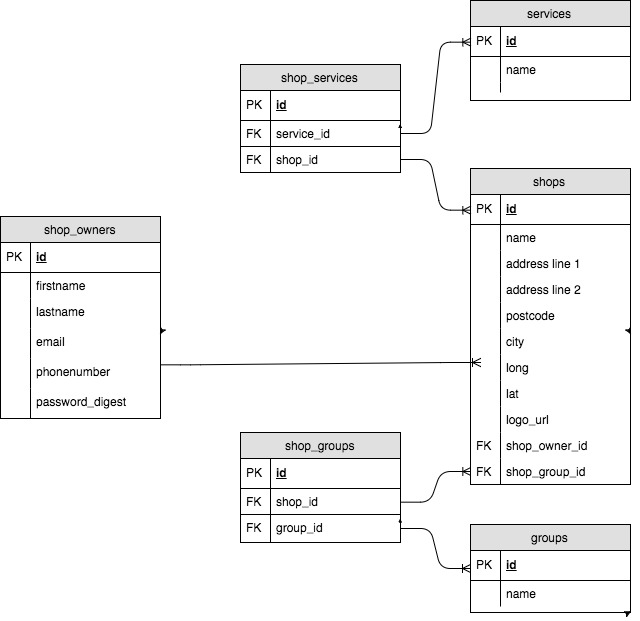
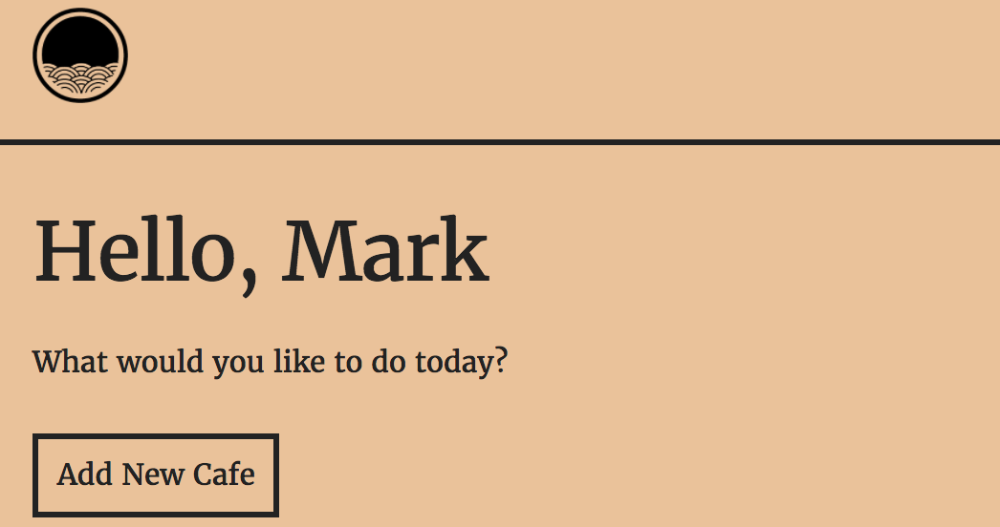

#   CAFFEINATE

**Technologies used: **
Ruby, Sinatra, HTML, SASS, JavaScript, Heroku, Postgresql

### How I approached this project ###

This project was our first full-stack project, meaning we had to use Front-end (HTML, CSS, JavaScript) and Back-end (Ruby, Sinatra, Postgres) technologies and deploy to Heroku.

In orden to come up with my idea, I set a 5 minute timer on my phone and started scribbling down as many ideas as I could before the timer ran out, without giving thought if the ideas were good or not.

I wanted to run my idea by my instructors before choosing the final concept, so I left the ideas and starting setting up my development environment so I could jump into coding when the planning phase was finished. I decided to use SASS as my CSS pre-processor, because I like the built-in functions and nesting when I work on larger projects. I used Gulp to compile my SASS to CSS, minify JavaScript, compress images and reload my browser on save to see changes. It was probably overkill for this project, but now I have a working Gulp file for the next project.

After talking to instructors about my favourite idea and getting positive feedback, I started making a Entity Relations diagram to figure out how the database tables would be connected to each other. My original idea included Shops, Users, Shop Owners, Services and a few more, but I made my scope smaller and prioritized basic CRUD functionality.

### Output ###
Shop owners are able to register and account and add as many shops as they want. The shops can only be updated and deleted by the account that created them. Every new shop will be displayed on the index page with name, address, logo, description and link to website.

]

### What I learned from this project ###

This time, I decided to spent more time in the planning face before jumping straight into coding, in the hope that I would have to spend less time re-writing code. It seemed to work, despite my urge to jump straight to developing the front-end like I usually do.

After the planning phase, I started developing the functionality and connecting to the server.

I decided to use a CSS framework called [Skeleton](https://getskeleton.com/) and keep the design very minimal.

## TO-DO List ##

- Add functionality for users to sign up, comment, rate and save favourite shops.

- Add search functionality based on location, services, group size.

- Add more styling and content
